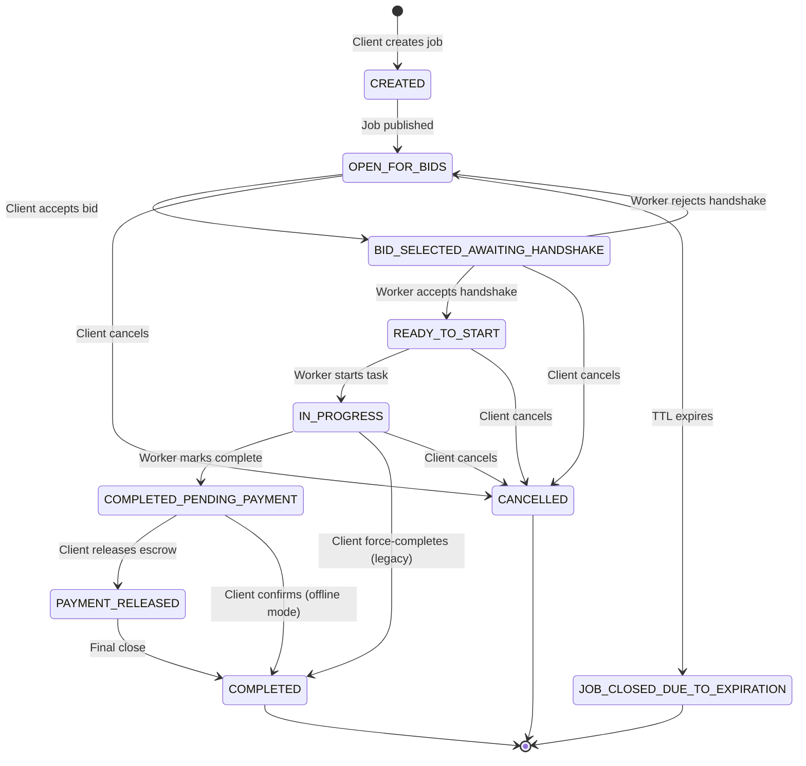

# AroundU — Production Readiness Report

## 1. State Transition Diagram

### Terminal States
- `COMPLETED` — job fully done, reviews allowed
- `CANCELLED` — client-initiated cancellation
- `JOB_CLOSED_DUE_TO_EXPIRATION` — system-initiated TTL expiry

### Review-Eligible States
- `PAYMENT_RELEASED` — escrow released, reviews open
- `COMPLETED` — final state, reviews open

---

## 2. Edge Cases Handled

| # | Edge Case | Guard | Location |
|---|-----------|-------|----------|
| 1 | **Duplicate escrow lock** | `findByJob()` check — rejects if `ESCROW_LOCKED` already exists | `PaymentServiceImpl.lockEscrow()` |
| 2 | **Non-owner tries escrow lock** | `job.getCreatedBy().getId() != clientId` check | `PaymentServiceImpl.lockEscrow()` |
| 3 | **Escrow lock in wrong state** | Only `READY_TO_START` or `BID_SELECTED_AWAITING_HANDSHAKE` | `PaymentServiceImpl.lockEscrow()` |
| 4 | **Escrow release in wrong state** | Only `COMPLETED_PENDING_PAYMENT`, `IN_PROGRESS`, or `COMPLETED` | `PaymentServiceImpl.releaseEscrow()` |
| 5 | **Worker tries unauthorized transition** | Restricted to `IN_PROGRESS` and `COMPLETED_PENDING_PAYMENT` only | `JobServiceImpl.updateJobStatusByWorker()` |
| 6 | **Invalid status transition** | Full state-machine validation in `validateStatusTransition()` | `JobServiceImpl` |
| 7 | **Review on ineligible job** | `job.getJobStatus().isReviewEligible()` must be true | `ReviewServiceImpl.submitReview()` |
| 8 | **Duplicate review** | Unique constraint on `(job_id, reviewer_id)` + `DataIntegrityViolationException` catch | `ReviewServiceImpl` |
| 9 | **Conversation already exists** | `conversationRepository.findByJobAndParticipants()` dedup | `BidServiceImpl.autoCreateConversation()` |
| 10 | **Conversation creation failure** | Fail-safe try/catch — bid acceptance is not blocked | `BidServiceImpl.acceptBid()` |
| 11 | **Duplicate bid by same worker** | Bloom filter precheck + DB unique constraint | `BidServiceImpl.placeBid()` |
| 12 | **Rate limiting on bid placement** | `@RateLimit` annotation on bid endpoint | `BidController` |
| 13 | **Payment service circuit breaker** | Resilience4j CircuitBreaker + Retry wrapping | `ResilientPaymentService` |
| 14 | **Redis unavailable for geo** | NoOp fallback services for GeoSync, Cache | Infrastructure layer |

---

## 3. Protected Business Rules

### 3.1 Job Lifecycle
- A job **must** transition through every state in order; no skipping.
- Only the **job owner (Client)** can accept bids, lock escrow, release payment, and cancel.
- Only the **assigned Worker** can start the task and mark it complete.
- **Terminal states** (`COMPLETED`, `CANCELLED`, `JOB_CLOSED_DUE_TO_EXPIRATION`) allow no further transitions.

### 3.2 Escrow
- Escrow lock **requires** a worker to be assigned (post-handshake).
- **One escrow per job** — duplicate lock attempts are rejected.
- Escrow release **automatically transitions** the job to `PAYMENT_RELEASED`.
- Only the job owner can lock or release escrow.

### 3.3 Bidding
- Bids are rate-limited per worker to prevent spam.
- Bloom filter provides fast duplicate-bid detection.
- Upon bid acceptance:
  - Bid status → `SELECTED`
  - Job status → `BID_SELECTED_AWAITING_HANDSHAKE`
  - **Chat conversation is auto-created** between client and worker.
- Worker handshake acceptance → `READY_TO_START`.
- Worker handshake rejection → job returns to `OPEN_FOR_BIDS`.

### 3.4 Reviews
- Reviews are only allowed on **review-eligible** jobs (`PAYMENT_RELEASED` or `COMPLETED`).
- **One review per reviewer per job** — enforced by DB unique constraint.
- Both client-to-worker and worker-to-client reviews are supported.
- Review eligibility can be checked via API before showing the UI.

### 3.5 Chat
- Conversations are created **automatically on bid acceptance** — no manual creation needed.
- If conversation already exists (e.g., prior interaction), creation is silently skipped.
- Conversation creation failure does **not** block the bid acceptance flow.

---

## 4. Final Readiness Checklist

### Backend

| Category | Item | Status |
|----------|------|--------|
| **State Machine** | All 10 JobStatus values defined | ✅ |
| **State Machine** | `validateStatusTransition()` covers all valid paths | ✅ |
| **State Machine** | Terminal states block further transitions | ✅ |
| **State Machine** | Worker-restricted transitions via dedicated endpoint | ✅ |
| **Escrow** | Lock validates ownership | ✅ |
| **Escrow** | Lock prevents duplicates | ✅ |
| **Escrow** | Lock validates job state | ✅ |
| **Escrow** | Release validates job state | ✅ |
| **Escrow** | Release auto-transitions job to PAYMENT_RELEASED | ✅ |
| **Escrow** | Circuit breaker + retry on payment service | ✅ |
| **Bidding** | Rate limiting on bid placement | ✅ |
| **Bidding** | Bloom filter duplicate check | ✅ |
| **Bidding** | Auto-conversation on acceptance | ✅ |
| **Reviews** | Client → Worker review | ✅ |
| **Reviews** | Worker → Client review | ✅ |
| **Reviews** | Eligibility guard (status check) | ✅ |
| **Reviews** | Duplicate review prevention | ✅ |
| **Reviews** | Eligibility check API | ✅ |
| **Chat** | Auto-creation on bid acceptance | ✅ |
| **Chat** | Fail-safe (doesn't block bid flow) | ✅ |
| **Infra** | Geo-sync with Redis | ✅ |
| **Infra** | NoOp fallbacks for Redis outage | ✅ |
| **Infra** | Prometheus metrics for payment states | ✅ |
| **Tests** | Full Journey 1 integration test | ✅ |
| **Tests** | Full Journey 2 integration test | ✅ |
| **Tests** | Journey 3 (chat) integration test | ✅ |
| **Tests** | Escrow guard tests (3 tests) | ✅ |
| **Tests** | State transition guard tests (3 tests) | ✅ |
| **Tests** | Review guard tests (2 tests) | ✅ |

### Flutter Mobile

| Category | Item | Status |
|----------|------|--------|
| **Models** | JobStatus enum has all 8 values | ✅ |
| **Models** | Color & label for every status | ✅ |
| **Models** | `isActive` / `isReviewEligible` helpers | ✅ |
| **View Model** | `_mapStatus()` maps all backend strings | ✅ |
| **API** | `updateJobStatusByWorker()` added | ✅ |
| **API** | `submitWorkerReview()` added | ✅ |
| **API** | `checkReviewEligibility()` added | ✅ |
| **QA** | Manual testing checklist created | ✅ |

### Remaining Items (Not in Scope)

| Item | Priority | Notes |
|------|----------|-------|
| Push notification on status change | P1 | `ApplicationEventPublisher` already in place; add FCM listener |
| Email notification on payment release | P2 | Use Spring `@EventListener` |
| Escrow refund on cancellation | P1 | Add `refundEscrow()` to PaymentService |
| Admin dashboard for dispute resolution | P2 | Existing admin role + endpoints needed |
| Flutter UI for worker status buttons | P1 | Wire `updateJobStatusByWorker` into job detail view |
| Flutter UI for review eligibility check | P2 | Call `checkReviewEligibility` before showing review form |
| Load testing (100+ concurrent bids) | P2 | JMeter + Gatling scripts |
| Database migration scripts for new statuses | P1 | Flyway/Liquibase migration for enum column |

---

*Generated from production-readiness audit. Last updated: $(date)*
